<link rel="stylesheet" href="index.css"><header class="container">
  
  <h1>mnart</h1>
</header>
<body class = "secContainer">
Social Android app dedicated to the professionals and amateurs art community to publish and sells their artworks and the Android phone users to interact and purchase their future art pieces.  

## Technologies
* Android (min SDK) 21 - (target) 30
* Java 8
* RxJava
* RxAndroid
* Retrofit
* Socket.io
* JWT for Authentication
* MVC design pattern
> please check app/build.gradle to refers to the dependencies $version.

## Get Started
Download or clone the project:
```bash
https://github.com/Houssem-Esprit/Mnart.git
```

> Make sure to download the backend servers [here](http://github.com) and [here](http://github.com).

## Screenshot


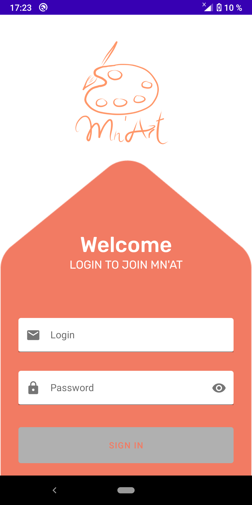 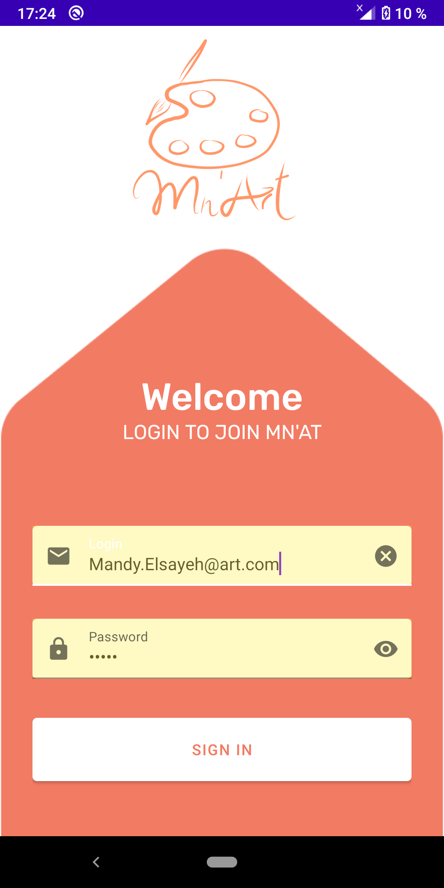
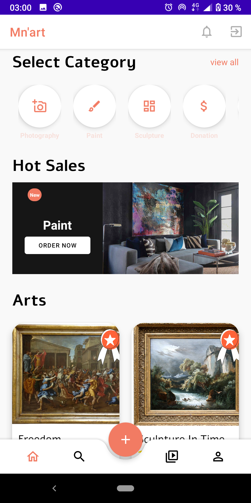 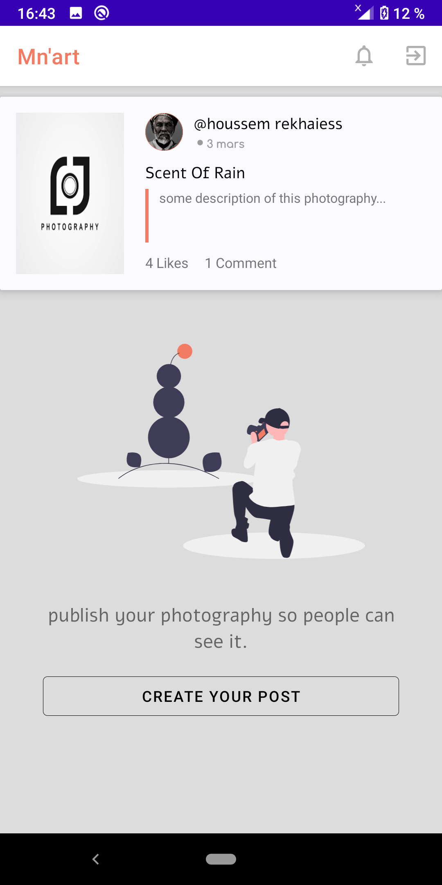
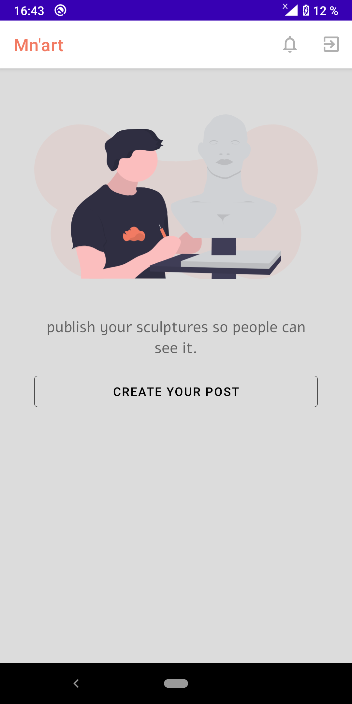 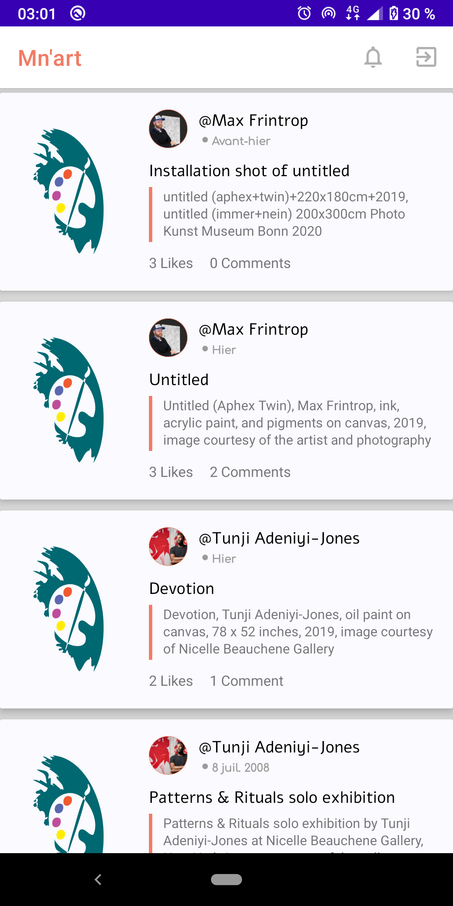
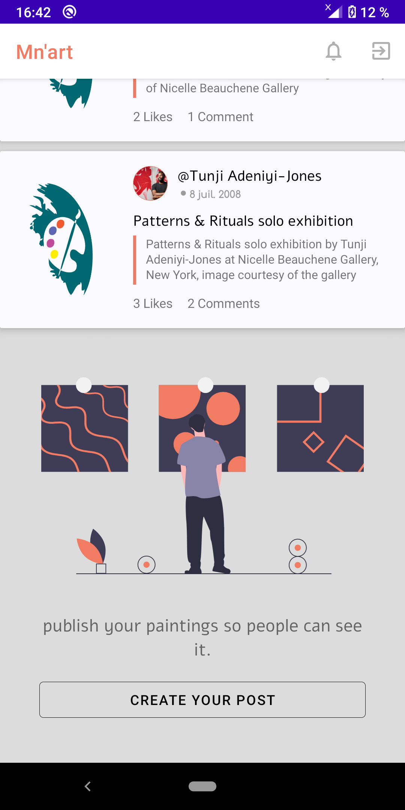 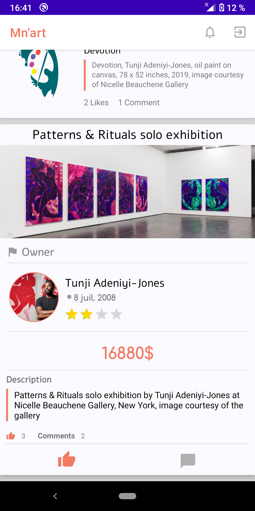
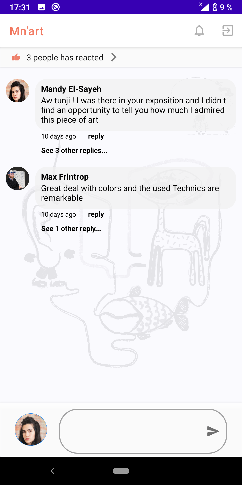 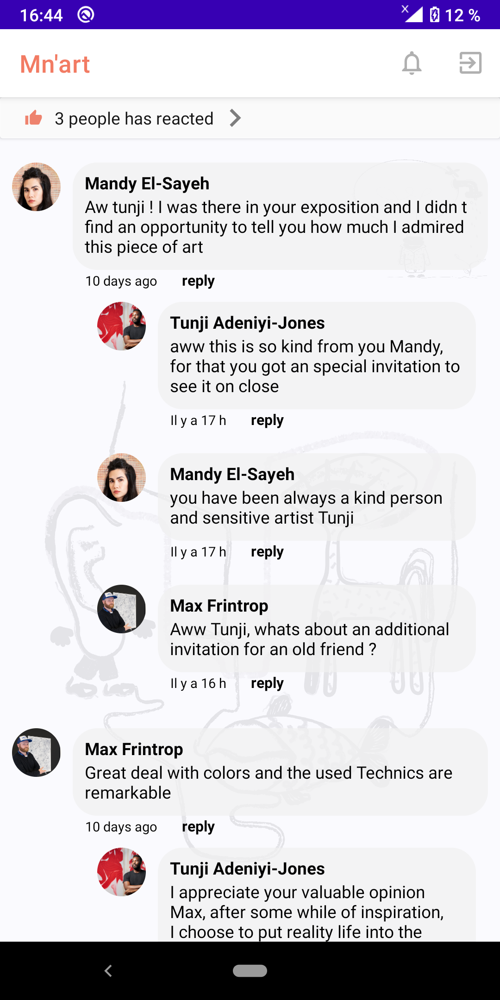
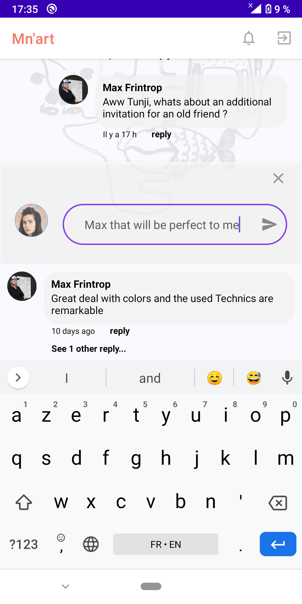 
 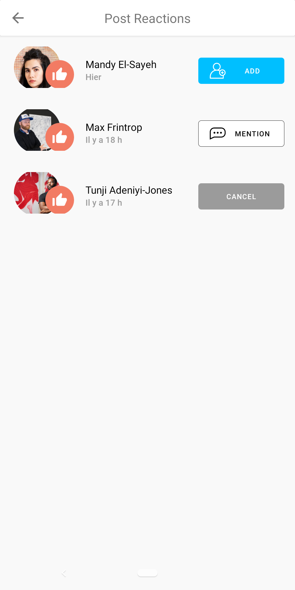
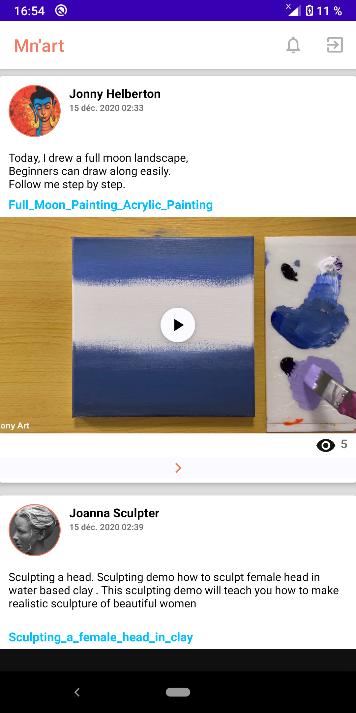 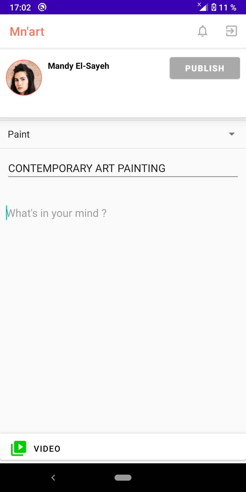
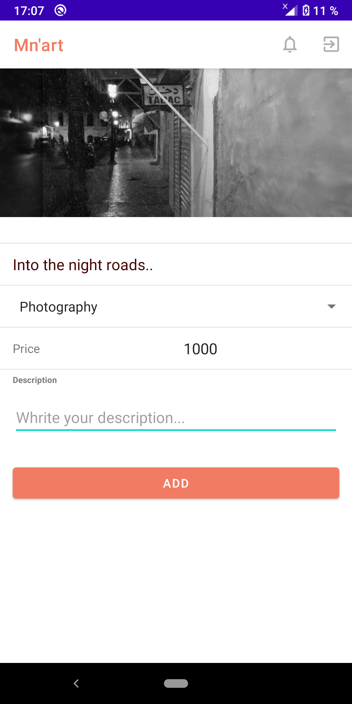 
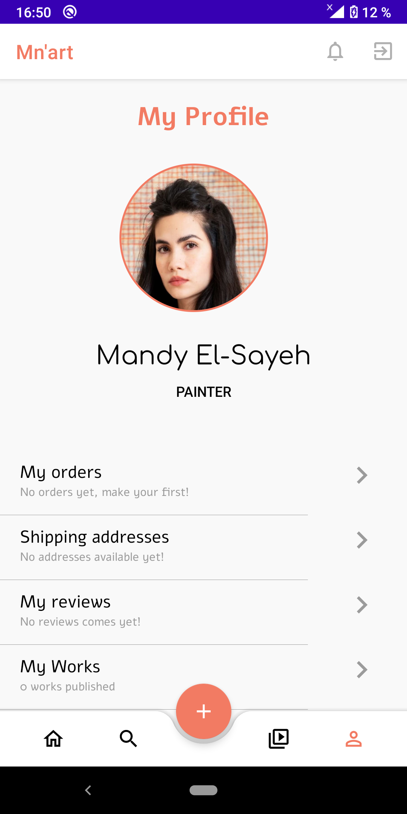 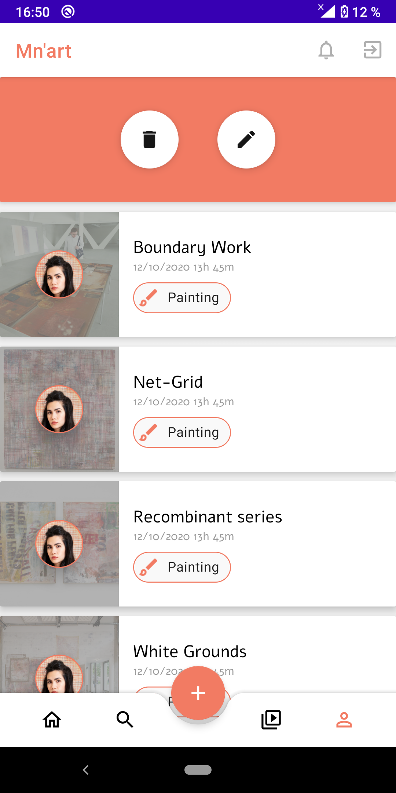 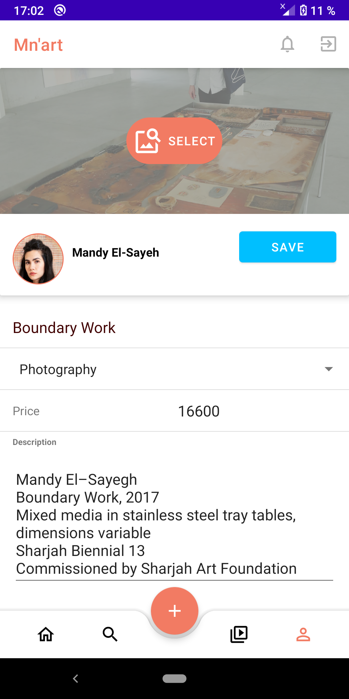
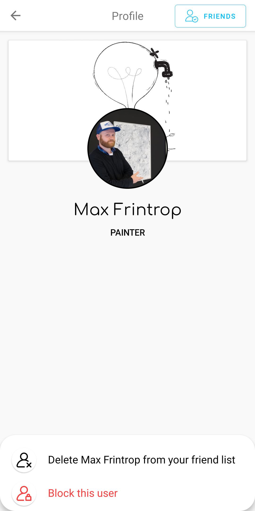 
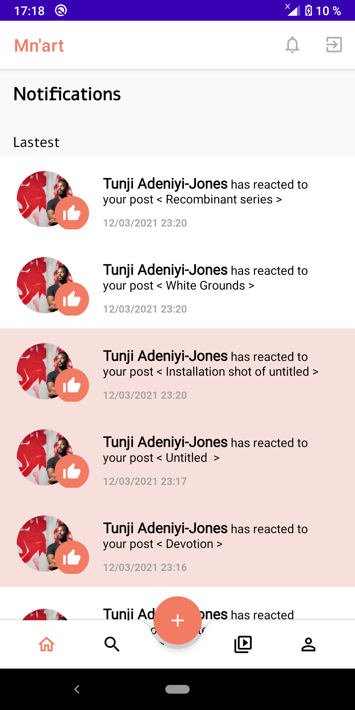 


</body>
